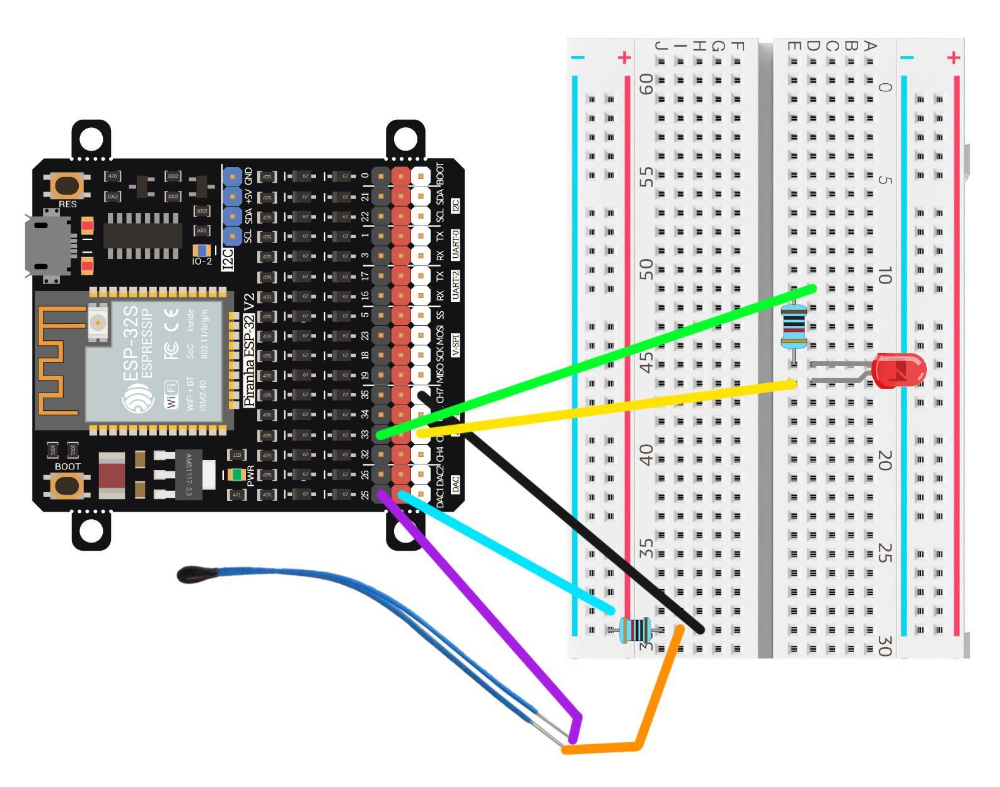

# Курсовой проект Telegram bot на piranha esp32 v2

Проект сделан в рамках курсовой работы студентом Максимом Ш. А.

## Описание
ESP32 подключается к Wi-Fi и обрабатывает команды, отправленные через Telegram. Возможности:
- Включение/выключение светодиода.
- Получение текущей температуры с термистора.
- Отправка меню с доступными командами.

## Требования
- **Piranha ESP32 V2**
- **Термистор NTC 3950** 
- **Резисторы**
- **Telegram Bot API Token**
- **Библиотека [FastBot](https://github.com/GyverLibs/FastBot2)**

## Подключение компонентов



| Пин ESP32 | Компонент  |
|-----------|-----------|
| GPIO 33   | Светодиод |
| GPIO 35   | Термистор |

## Установка и настройка
1. Установите **Arduino IDE** и установите плату ESP32.
2. Установите библиотеку **FastBot** через менеджер библиотек.
3. Создайте Telegram-бота с помощью **@BotFather** и получите API токен.
4. Откройте код в Arduino IDE.
5. Укажите ваши данные Wi-Fi и токен бота:
   ```cpp
   #define WIFI_SSID "Имя вашей wifi сети"
   #define WIFI_PASS "пароль от вашей wifi сети"
   #define BOT_TOKEN "Ваш телеграм токен для бота"
   ```
6. Загрузите код на ESP32 и откройте монитор порта (115200 бод).
7. После подключения к Wi-Fi бот начнет работать.

## Доступные команды
Отправьте команду в Telegram:
- `/led_on` - Включить светодиод.
- `/led_off` - Выключить светодиод.
- `/get_temp` - Получить температуру.
- Любое другое сообщение - показать список команд.

